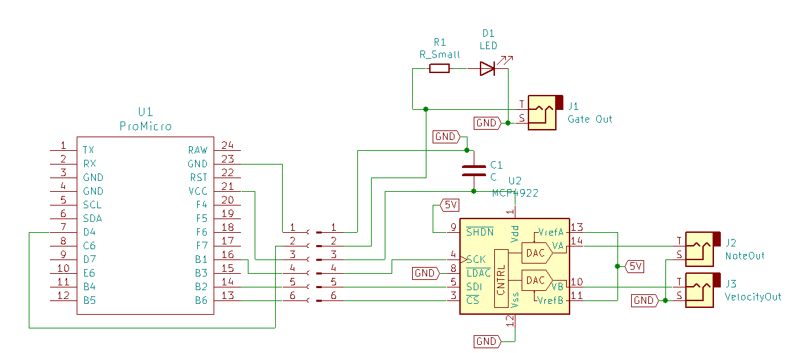

# MidiFox:  *a Eurorack Module*

# Introduction

The MidiFox is a small Eurorack Module, that takes a Midi-Signal via MicroUSB from a Computer and turns it into  Eurorack usbale Note value, midi velocity and gate CV.

# Hardware

### Schematic

### BOM
Part | Value | Quantity | Comment
--- | --- | --- | ---
Sparkfun ProMicro |  | 1 | 5V
MCP4922 |  | 1 | Dual Channel DAC
LED |  | 1 | Pick any Color you like
Audio Jack | 3.5mm | 3 | 
Resistor | ? | 1 | LED resistor, Value dependent on the LED
Capacitor  | 100nF | 1 |
Wire | | some |

# Manual

For more Information please refer to the pdf manual.

## Dependencies 

- Arduino MIDUSB 
    - [Reference](https://www.arduino.cc/en/Reference/MIDIUSB)
    - [Repository](https://github.com/arduino-libraries/MIDIUSB)
    - available under [GNU GPL](https://www.gnu.org/licenses/lgpl-3.0.de.html)

## Configuration
The `noteTable` may need configuration/tuning.
